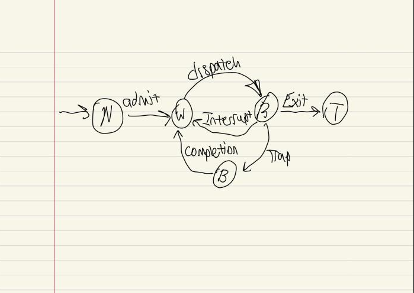

# Quiz #1: Models of Communication and Computation
### Date: February 12, 2020
### Estimated time: 1 hour
### Exam Time-frame
* Start: Friday: 18:00 (6:00pm)
* End: Saturday: 18:00 (6:00pm)

---
## Name: Matthew Engler                                                 <!-- answer -->
## GitHub Account: MattEngler7                                       <!-- answer -->


1. We can use a Finite State Machine (FSM) to model the interaction between the OS and your program.
On a piece of paper, 
   - draw the Process Status Diagram (PSD)
   - label both it states and edges
   - upload a picture of your FSM
   - submit this picture with the name of PSD.png<br>
  


1. An ISA is an abstraction for a physical computer.  This abstraction includes five (5) characteristics.  Enumerate these 5 major characteristics.
   1. Operand storage inside the CPU- Its the location of the operands other than the memory.                                                    <!-- response -->
   1. Number of Explicit named operands- THe number of operands named in a typical instruction.                                                    <!-- response -->
   1. Operand location- Defines any ALU instruction operand can be located in memory or all operands.                                                    <!-- response -->
   1. Operands- It defines the operands that are provided in the set architecture.                                                     <!-- response -->
   1. Type and size of operands- Defines the type of size of each operand and also how it is specified.                                                    <!-- response -->
   1.                                                     <!-- response -->

1. Briefly describe the difference between a Sequential circuit and a Combinational Circuit.
   ```
           The difference is that combinational circuit depends on the inputs at the same instant of time. In a sequential circuit output depends on both present and past inputs.                                                <!-- response -->
                                                          <!-- response -->
   ```

   <!-- You may add additional lines in your answer.  Make sure you place the response tag on each of these lines. -->


1. Define the following terms:
   1. interrupt
      - A singal from a devide attached to a computer or a program from within the computer that requires the OS to stop and figure out what to do next.                                                   <!-- response -->
   1. trap
      - A synchronus interrupt triggered by an exception in a user process to execute functionality.                                                   <!-- response -->
   1. lval
      - is the address in memory.                                                   <!-- response -->
   1. rval
      - is an address also known as a pointer.                                                   <!-- response -->


1. A 'Universal Computer' is an abstract machine based upon the Turing Machine.  This computer has a standardized control program to manage the underlying finite state machine. (This control program is akin to the computer firmware).  Two other programs are placed on the tape.  What are these two other programs:
  1.  A specific Turing machine is characterized by a standard that indicates how the head should treat each progression. The standard glances at the condition of the head, and the shade of the cell that the head is on. Then, at that point, it determines what the new condition of the head ought to be, what shading the head ought to "express" onto the tape, and regardless of whether the head should move left or right.                                                    <!-- response -->
  1.                                                      <!-- response -->


1. What is the purpose of computing and validating the checksum value associated with an IPv4 header.
   ```
       The IPv4 header checksum is a checksum used in version 4 of the Internet Protocol to detect corruption in the header of IPv4 packets. It is carried in the IP packet header, and represents the 16-bit result of summation of the header words.                                                   <!-- response -->
                                                          <!-- response -->
   ```


1. Memory can be modeled as an array of bytes.  A register on the MIPS architecture contains 32 bits.  What role does endiance play when we execute an instruction to load a register with values stored within memory.
   ```
       Endiance determines the the order or sequence when processor stores a word information from its register to memory or the reverse way around, loads a word information from memory to its register                                                   <!-- response -->
                                                          <!-- response -->
   ```

1. Given the following configuration of memory, answer the following questions:
   1. What is the value stored in memory at location `0x8000 0007`: 
      -  1     <!-- response -->
   1. What is the label associated with location `0x8000 0009` in memory
      -  42     <!-- response -->
   1. What is the lval associated with `B`:  
      -   202    <!-- response -->
   1. What is the rval associated with `B`:
      -    0x8000 0003   <!-- response -->
   1. What is the rval associated with `C[3]`:
      -   0    <!-- response -->
   1. What is the lval associated with `C[3]`:
      -   0x8000 0008    <!-- response -->

|   | mem|            |
|---|---|-------------|
|     | 253 |  0x8000 000A |
| D:  |  42 |  0x8000 0009 |
|     |   0 |  0x8000 0008 |
|     |   1 |  0x8000 0007 |
|     |   2 |  0x8000 0006 |
| C:  |   3 |  0x8000 0005 |
|     |  77 |  0x8000 0004 |
| B:  | 202 |  0x8000 0003 |
|     |  54 |  0x8000 0002 |
| A:  | 123 |  0x8000 0001 |


