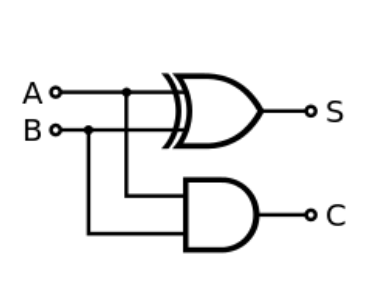
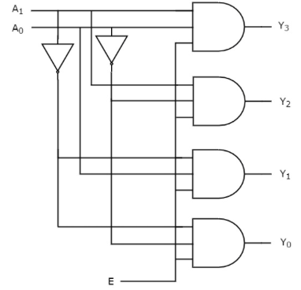

# Quiz #2: Digitial Logic 
### Date: November 9, 2021
### Allocated time: 1.5 hours (with a 10 minute cushion)
### Exam Times
* Morning Class:  9:05am -- 10:45  
* Afternoon Class:  2:05pm -- 3:45

---
## Name:                                            <!-- answer -->
## GitHub Account:                                  <!-- answer -->

### Boolean Algebra
1. Given the following circuit, provide the equivalent Boolean expression:
   * S = A (+) B , C = A\*B                                <!-- answer -->
   

 
1. Given the following truth table, provide the equivalent Boolean expression:
   *  A'B'C + A'BC' + AB'C' + AB'C + ABC'                            <!-- answer -->

  | A  | B  | C | Output |
  | -- | -- |-- | -- |
  | 0  | 0  | 0 | 0 |
  | 0  | 0  | 1 | 1 |
  | 0  | 1  | 0 | 1 |
  | 0  | 1  | 1 | 0 |
  | 1  | 0  | 0 | 1 |
  | 1  | 0  | 1 | 1 |
  | 1  | 1  | 0 | 1 |
  | 1  | 1  | 1 | 0 |

### Combinational Circuits
1. What is the difference between a control line and a data line?
   * Nothing, just how we perceive or use the values                     <!-- answer -->

1. You have been asked to produce a combinational circuit that can select exactly 1 output from 16 different possible inputs.
   1. What basic combinational ciruit should be used?
      * Multiplex                           <!-- answer -->
   1. How many selector lines will this circuit have?
      * 4                                  <!-- answer -->

1. You have a CPU that has 120 registers. (Yes, 120 registers!)
   1. How many selector lines are included in this circuit
      *  7 (which gives you 128 possible inputs to select from)          <!-- answer -->

1. Consider the following circuit

   

   1. What is the type of this circuit?
      *  2x4 Decoder                             <!-- answer -->

1. You are provided with a 5-32 Decoder.
   1. What is the role of the "E"nable line?
      * To have either all outputs cleared or exactly one output to be set    <!-- answer -->

   3. What is the total number of inputs to this circuit?
      *  6                               <!-- answer -->

   5. What is the total number of outputs from this circuit?
      *  32                                <!-- answer -->

### Sequential Circuits

1. Explain the primary difference between a combinational and a sequential circuit.
   * A Combinational circuit as no notion of time, and the computination is static. Wheres a sequential circiut requires a memory device and a clock.                                    <!-- answer -->
2. What is the primary difference between a SR-latch and a D-latch?
   * The D-latch has additional circuit try to ensure the underlying SR-latch is never provided within inconsistent inputs.                           <!-- answer -->

### Microarchitecture

1. A CPU is an example of a sequential circuit, where different parts of the circuit is executed in well defined steps.  Answer the following questions related to such a sequential circuit.
   1. For the MIPS microarchitcture, enumerate and describe briefly what each of these steps does:
      1. Fetch: PC is incremented by 4, and the next instruction is read from main memory.                        <!-- answer -->
      1. Decode: the appropriate registers are feed to ALU, etc     <!-- answer -->
      1. Execute: the ALU performs the necessary function           <!-- answer -->
      1. Mem: A read or write operation is performed on data        <!-- answer -->
      1. Write-back: results are written to registers               <!-- answer -->
      <!-- Feel free to add or remove additional answer lines as needed. -->
 
   1. What type of digital component is used between each of these steps?
      *  latchs                                  <!-- answer -->
 
   1. Why is the value of the PC incremented by 4 in each "fetch" stage?  
      * 4 bytes are needed to encode every MIPS instruction        <!-- answer -->

