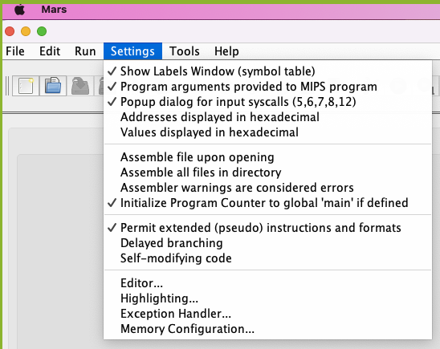

# Pythagorean.mips

```
Pythagorean Theory: The following relationships hold true for all triangles:

   a^2 + b^2 < c^2, if it is an acute triangle
   a^2 + b^2 = c^2, if it is a right triangle
   a^2 + b^2 > c^2, if it is an obtuse triangle
```

### Overview
In this assignment, you need to write a series of MIPS programs.  Each of these programs build upon each other by using an additional items associated with assembly programming. These additional items include:

 * Use of an if-then-else construct
 * Use of multiple if-then-else constructs together
 * Use of a loop construct and macros
 * Use of subroutines (provided and user-defined)
 * Use of a outer loop to read stdin

For each of these programs, you must provided a ``git tag``. This tag will allow a user to checkout your program, at various stages of development, and to run it --- all from the same repository. 

## Process
You will write your programs in 5 distinct phases. The Professor will be testing each of your phases via the "checkout" feature of git. As such, you will need to add a "tag" to the final version of your code for each and every phase.

You need to complete the following steps during each phase of this assignment.

  1. Incrementally edit, test, and submit your program, "pythagorean.s"
     * i.e., edit, test, ``git add``, ``git commit``, ``git push``
  1. When you complete a phase, 
     1. add the associated tag: ``git tag <tag>``
     1. push your tag to the remote repo: ``git push origin --tags``

The Professor will later perform the following steps:

  1. ``git pull``: to get your latest version of your repository
  1. ``git checkout <tag>``: to get the version of the code associated with a specific tag.
  1. ``make <tag>_test``: to test your program

You can also perform a ``git checkout <tag>`` at anytime to view the final version of your code for a particular phase.[^readonly]  Running the command ``git checkout main`` will reset your version to be the newest version of your repository.

[^readonly]: You should consider this version to be a read-only version. As you learn more about ``git``, this limitation can be removed.  But for now... just consider it read-only.


## Due Dates:
A separate due date will be provided for each phase.  The following due dates are provided to help you scheduled your time effectively.  These dates are subject to change, based upon the progress we make in class.  Such changes will be announced in slack and via the assignment.md file.

   1. Due: April 14 @ Midnight: Is Right Triangle
   1. Due: April 17 @ Midnight: Type of Triangle
   1. Due: April 19 @ Midnight: Approximate the Hypotenuse
   1. Due: April 21 @ Midnight: Evaluate the Hypotenuse
   1. Due: April 24 @ Midnight: Series of Triangles


## MARS Notes:
You can use MARS both as a command-line tool and as a IDE.  To facilitate the use of MARS, make sure you:

   1. Update you \~/.profile file to allow you to launch MARS IDE from the command-line.<br>
      Add the following lines the your \~/.profile.
      ```
      alias comp122='cd ~/Desktop/classes/comp122'
      export MARS_JAR=$HOME/Desktop/classes/comp122/mars-mips/mars/Mars4_5.jar
      alias mars="java -jar ${MARS_JAR} $*"
      ```
      If you choose to setup your laptop for COMP122 other than the way I prescribed in the first week of the class, you will need to update the lines above accordingly.

   1. Launch MARS IDE as follows:
      ```
      # launch a terminal
      comp122                             # goto your comp122 folder
      cd deliverables/41-pythagorean      # navigate to the assignment folder
      mars                                # launch MARS
      ```
   1. Update your MARS environment, via the Setting Section. Use the following .png file to ensure you have the appropriate options checked.

      


   1. Launch MARS program the command line
      ```
      # launch a terminal
      # navigate to the correct folder
      mars pythagorean.s                  # assembly and execute the pythagorean.s project
      ```


## Phases-Overview:
   1. Is Right Triangle:
      * Inputs: a, b, c
      * Evaluates the equation: ``a^2 + b^2 == c^2``
      * Outputs: "True!" or "False!" 
      * Tag: is_right

   1. Type of Triangle:
      * Inputs: a, b, c
      * Evaluates a set of equations:
        ```
        a^2 + b^2 < c^2
        a^2 + b^2 == c^2
        a^2 + b^2 > c^2
        ```
      * Outputs: "Acute!", "Right!", or "Obtuse!"
      * Tag: angle_type


   1. Approximate the Hypotenuse
      * Inputs: a, b
      * Evaluates the equation: ``a^2 + b^2``
      * Via a loop of "c" where ``c = max(a,b) .. (a+b)``, <br>
        determines the smallest value of "c", where
        ```
        a^2 + b^2 >= c^2
        ```
      * Outputs: "Nearest right-triangle is where the hypotenuse is: ", c
      * Tag: approximated_hypotenuse


   1. Evaluate the Hypotenuse(Need to start)
      * Inputs: a, b
      * Determines the value of "c" via the subroutine: <br>
        ``c = hypotenuse(a,b)``
      * Uses the ``c = isqrt(X)`` subroutine to compute the square root of X
      * Outputs: "The computed integer value of c is: " c
      * Tag: computed_hypotenuse

   1. Series of Triangles(Need to do)
      * Inputs: a series of a's and b's
        - "Evaluates the Hypotenuse" 
        - Terminates when the input pair is "0" and "0"
      * Revised Output:``a^2 + b^2 ~= c^2``
      * Tag: series

## Phases-Description:

### Is Right Triangle:
During class time, the professor walked you through the elements of the program.  Depending on which class you attend, the Professor used a different technique.  Use the code from your notes to get your initial program started.  The four versions of the code, from the four class sessions, are provided for comparison and are located in:

   ```
   comp122/deliverables/41-pythegorean/starter_code
   ```

You may use the provided ``pythegorena.s`` file as a starting point. It includes some initial comments and some setup code.

The elements of the program were:
   1. read three unsigned 8-bit integers using the read_int syscall
   1. evaluate:  X = a^2 + b^2
   1. evaluate:  Y = c^2
   1. construct an if-then-else control flow, where the Boolean test is:
      `` X == Y``
   1. print the appropriate string via the write_string syscall
      * print "True!" if the Boolean test is true.
      * print "False!" if the Boolean test is false.
   1. terminate the program via the exit syscall

### Type of Triangle:
In the next version of the program, you are to modify the output of the program based upon the comparison of X and Y. You can model your code using the following Java code.

  ```
  if (X == Y) { System.out.printf("Right!\n") }
  if (X < Y)  { System.out.printf("Acute!\n") }
  if (X > Y)  { System.out.printf("Obtuse!\n") }
  ```

You may restructure your program differently to make it more readable or more efficient.  One such alternative is to compute the difference between X and Y.  Then you can select the appropriate output based the value of the difference.

   ```
   if diff is negative, then ...
   if diff is zero, then { System.out.printf("Right!\n") }
   if diff is positive, then ...
   ```


### Approximate the Hypotenuse
In the next version of the program, you are to modify the program to only have two input values: a and b.  You must also approximate the value for "c" associated with a right triangle. The valid range for "c" is between max(a,b) and (a+b).  The following for loop illustrates how we can determine the value for "c".

  ```
  for c in max(a,b) .. (a+b) ; do 
     Y = c * c;
     if (Y >= X) break;
  done
  ```

You may use either any loop of your choosing to determine the approximate value of C.  The pseudo code for a while loop, a do-while loop, a for loop are provided.

While Loop:
  ```
  c = max(a,b);
  Y = 0;
  while (Y < X) {
     Y = c * c;
     c ++;
  }
  ```

Do-While Loop:
  ```
  c = max(a,b);
  do {
    c ++;
    Y = c * c;
  } while ( Y < X )
  ```

For Loop:
  ```
  for (c = max(a,b), Y = 0; Y < X; c++) {
    Y = c * c;
  }
  ```

You should select the type of loop that results in MIPS code that the best from a readability standpoint.  In this version of your program, you must also create a macro call "max" to make your program more readable.  


### Evaluate the Hypotenuse
In the next version of the program, you need to refactor your program to conform to the following conditions:
   1. utilize the syscall macros to make your program more readable.
   1. utilize the isqrt() subroutine. 
   1. define the subroutine hypotenuse(a, b).

Under this version of your program, you need to exercise subroutine calling, which requires you to save and restore registers. Remember, registers are shared by *all* subroutines.  Hence, there is a need to save and restore registers at strategic points.

As such, your program is to be structured as follows:

  ```
  main: nop
        # Handle the inputs, etc
        # ....

        # make a call to the subroutine hypotenuse
        move $a0, a
        move $a1, b
        #-- save registers as needed
        jal hypotenuse
        #-- restore registers as needed
        move c, $v0

        # Handle the outputs, etc
        # ....

        exit()


  hypotenuse:
       # save registers as needed
       # ....

       # make a call to isqrt()
       move $a0,  a^2 + b^2
       #-- save registers as needed
       jal isqrt
       #-- restore registers as needed
       move c, $v0

       # -- restore registers as needed
       # return to main subroutine
       mv $v0, c
       jr $ra
  ```

Ideally, you should follow the MIPS convention for subroutine calling. You may, however, simplify things by taking steps to allocated a subset of registers to each subroutine.  (This includes the "isqrt()" subroutine.)  

The downside of allocating specific registers to specific subroutines is that you *cannot* develop your subroutines independently.  As such, such an approach is looked down upon.  But for this assignment, it is acceptable.

In either approach, you should better understand why such a convention exists, which is the point of this phase.


### Series of Triangles
In this final version of the program, you need to refactor just the "main" subroutine to iterate over a series of inputs.  Here you should use a loop to process the input.

The general flow of your "main" subroutine should be:

  ```
  main:  nop
        
  loop_top: nop
         # Handle the inputs, etc
         # ....

         if (a == 0 && b == 0) goto loop_end

         # make a call to the subroutine hypotenuse
         jal hypotenuse
         move c, $v0

         # Handle the outputs, etc
         # ....
         goto loop_top
   loop_end:  

  ```

### Testing Steps

1. Navigate to the correct directory and obtain the most recent version of the repo
   ```
   comp122
   cd deliverables/41-pythagorean
   git pull
   ```

1. Test each individual phase
   1. Is Right Triangle:
      * Commands and Inputs:
      ```
      git checkout is_right
      mars pythagorean.s
      3
      4
      5
      ```
      * Output:
      ```
      True!
      ```
   1. Type of Triangle:
      * Commands and Inputs:
      ```
      git checkout angle_type
      mars pythagorean.s
      3
      4
      6
      ```
      * Output:
      ```
      Obtuse!
      ```


   1. Approximate the Hypotenuse
      * Commands and Inputs:
      ```
      git checkout approximated_hypotenuse
      mars pythagorean.s
      3
      4
      ```
      * Output:
      ```
      Nearest right-triangle is where the hypotenuse is: 5
      ```


   1. Evaluate the Hypotenuse
      * Commands and Inputs:
      ```
      git checkout computed_hypotenuse
      mars pythagorean.s
      5
      12
      ```
      * Output:
      ```
      "The computed integer value of c is: " 13
      ```


   1. Series of Triangles
      * Commands and Inputs:
      ```
      git checkout computed_hypotenuse
      mars pythagorean.s
      5
      12
      8 
      15
      0
      0
      ```
      * Output:
      ```
      5^2 + 12^2 ~= 13^2
      8^2 + 15^2 ~= 17^2
      ```


